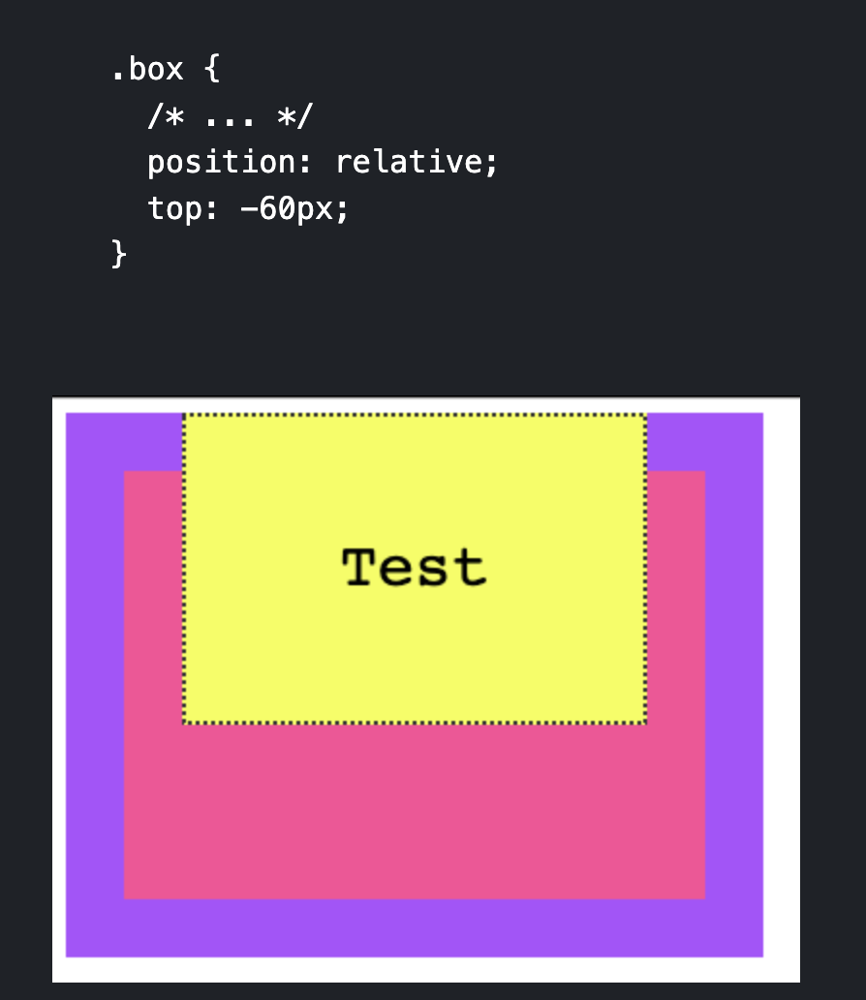

# More CSS

## Box Model

* In HTML and CSS, every element is essentially a box
* The box model explains how elements are presented and manipulated in CSS
* There are 4 areas in the CSS box model
    * From inside to outside
    1. Content Area
    2. Padding Area
    3. Border Area
    4. Margin Area
* Ex.


* Setting width or height sets the content area not the padding, border, or margin areas

## Border

* The border is the thin area between the padding and margin
* Essentially, editing this area allows for editing the perimeter of the element
* Can work on borders using these properties:   
    1. border-style
    2. border-color
    3. border-width
    4. border-radius
* Can set images for borders with border-image

### Border-style

* **border-style** property allows for picking the style of border
    * Ex.
        * dotted
        * dashed
        * solid
        * double


### Border-width

* **border-width** allows for specifying the width of hte lines of the border
    * word values are:
        * thin
        * medium
        * thick
    * length values using "em" or "px" can also be used

### Border-color

* **border-color** is utilized to set the color of the border
* Default color is the element's text color

### Border-radius

* **border-radius** is used to set rounded corners in the border
* Value that is passed is the radius of the circle on the corners used to round the border

* Ex.

<style>
    .border {
        width: 100%;
        height: 100px;
        border-style: dotted solid dashed double;
        border-radius: 10px;
        border-color: red;
    }
</style>


<p class="border">
    Border example with border-radius, border-width, border style, and border-color
</p>

## Margin

* A CSS property that is used to add space around an element
* Margin adds space outside an element border
* Padding on the other hand adds space inside an element border
* Margin have 4 properties that can be specified:
    1. margin-top
    2. margin-right
    3. margin-bottom
    4. margin-left
* margin is typically utilized to add small amounts of spacing or for centering elements by using "auto"
    * Ex.
    ```
    .class {
        margin: 0 auto
    }
    ```
* This makes the top and bottom margin 0 px while letting the browser automatically decide the spacing of the left and right margins for the element
* Ex.

<style>
    .margin {
        margin: 0 auto;
        width: 300px;
        height: 100px
    }
</style>

<p class="margin">
    Some Test for margin centering using "auto"
</p>

* Margin is also allowed to have negative values on the properties which makes it extend the opposite way

## Padding

* Padding is the same as margin except that it adds space to the area inside the element border
* Margin adds space outside the element border
* Padding adds space inside the element border
* Similar to margin, it has 4 properties:
    1. padding-top
    2. padding-right
    3. padding-bottom
    4. padding-left
* Ex.

<style>
    .padding {
        width: 300px;
        height: 300px;
        padding: 30px 30px;
        background-color: orange;
    }
</style>

<p class="padding">
    Some text to demonstrate padding
</p>

## Box Sizing

* By default, the browsers calculate width and height of an element before the padding, border, and margin
* It gets complicated so there is a "box-sizing" property that allows for 2 property values:
    1. border-box
    2. content-box
* "border-box" changes the box-sizing such that the width and height calculation include the padding and the border
* Recommended to "reset" the CSS for every element to this setting since it is more intuitive
    * Ex.
    ```
    *, *::before, *::after {
        box-sizing: border-box;
    }
    ```
* Ex.

<style>
    .border-box {
        width: 300px;
        height: 100px;
        box-sizing: border-box;
        background-color: pink;
    }
</style>

<p class="border-box">
    Example testing out "border-box"
</p>

## Display

* "Display" property determines how the element is displayed by the browser
* 3 types of display elements (excluding "grid", "flex", "table")
    1. block
    2. inline
    3. none

### Inline

* With "inline" as the property value, the elements don't have any margin or padding applied as well as height and width
* It appears "inline" with the elements that precede and come after it

### Block

* Some elements are automatically set as "block" elements by the browser
* Block elements are those that take up 100% of the width of the screen
* They also stack on top of each other when placed one after another 
* The width and height properties are actually utilized and can also set the margin and padding

### None

* Display "none" hides the visibility of the element on the page
* The element will still be in the HTML code, but will not be rendered by the browser

## Positioning

* Property that determines where elements appear on the screen and how they appear
* Can have 5 values:
    1. static
    2. relative
    3. absolute
    4. fixed
    5. sticky

### Static

* This is the default setting that follows the normal page structure created from and HTML document

### Relative

* Allows for positioning using 4 properties:
    1. top
    2. left
    3. right
    4. bottom
    * Called offset properties tha accept a length as value
* Position relative allows for positioning the element relative to the parent element that is containing it



* Here we can see that the .box class (yellow) can be specified its position relative to the parent container which is the pink box

### Absolute

* Position absolute takes the element outside of the normal HTML flow and allows for manual positioning
* Only the (x, y) starting point is preserved
    * The starting point is the starting point of the closest container that is not static


### Fixed

* Position fixed is the same as position absolute except that the starting coordinates (x, y) are always positioned relative to the window
instead of the first non-static container
* Also fixed elements are not affected by scrolling, they will remain on the page even if scrolling occurs

### Sticky

* Position sticky is the same as fixed except that it stays at the top of the screen when the screen's scrolling has reached that element's scrolling point
* This means that it will act like static until its scrolling point is reached and then act like fixed at the top of the screen if the user keeps scrolling

## Floating

* Floating allows you to remove an element from the normal page flow and used to be the old way to create "modern" layouts
    * Kind of not utilized as much because of "Grid" and "Flexbox"
* Supports 3 values:
    1. left
    2. right
    3. none (default)
* Normally, the browser renders things like imgs and spans inline together one after another, meaning imgs will show in the middle of the text or not formatted
    * Can be fixed with floats
    * Ex.
    
* Floated elements are removed from the normal flow of the page and the content flows around it

### Clearing

* Floating multiple elements will make them just stack next to each other horizontally
    * If space runs out at it will start a new line
* There is a property called "clear" that remedy's this and allows for horizontally floated elements to be stacked vertically
* Ex.

* For clearing use:
    * "left" to clear left floats
    * "right" to clear right floats
    * "both" to clear both left and right flaots
    * "none" (default)

## Tables

* Tables used to be heavily utilized to create fancy page layouts but are not really utilized except for creating tables because of "grid" and "flexbox"
* Can easily style every other row to have a different color utilizing :nth_child(odd) or :nth_child(even) selector
* Ex.

<style>
    table, th, td {
        border: 1px solid #333;
    }

    tbody tr:nth-child(odd) {
        background-color: #af47ff;
    }
</style>

<table>
  <thead>
    <tr>
      <th scope="col">Name</th>
      <th scope="col">Age</th>
    </tr>
  </thead>
  <tbody>
    <tr>
      <th scope="row">Flavio</th>
      <td>36</td>
    </tr>
    <tr>
      <th scope="row">Roger</th>
      <td>7</td>
    </tr>
    <tr>
      <th scope="row">Syd</th>
      <td>10</td>
    </tr>
  </tbody>
</table>


