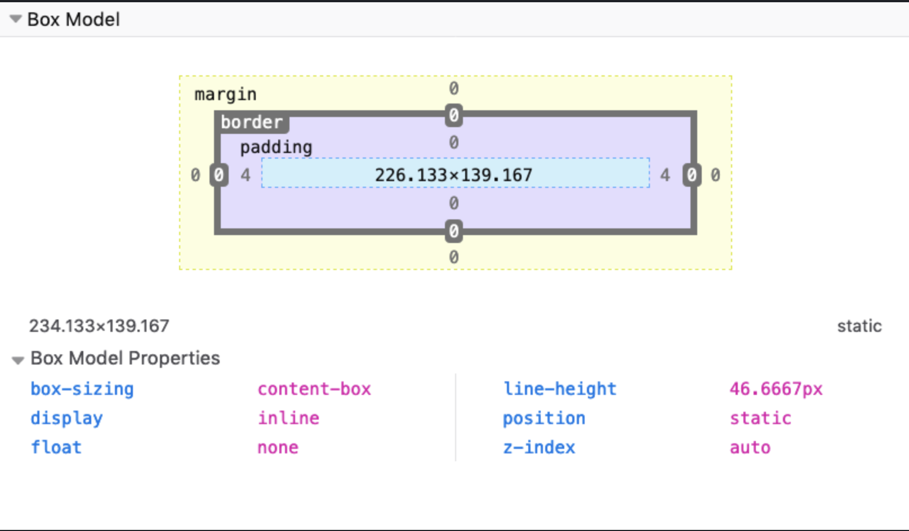

# More CSS

## Box Model

* In HTML and CSS, every element is essentially a box
* The box model explains how elements are presented and manipulated in CSS
* There are 4 areas in the CSS box model
    * From inside to outside
    1. Content Area
    2. Padding Area
    3. Border Area
    4. Margin Area
* Ex.

* Setting width or height sets the content area not the padding, border, or margin areas

## Border

* The border is the thin area between the padding and margin
* Essentially, editing this area allows for editing the perimeter of the element
* Can work on borders using these properties:   
    1. border-style
    2. border-color
    3. border-width
    4. border-radius
* Can set images for borders with border-image

### Border-style

* **border-style** property allows for picking the style of border
    * Ex.
        * dotted
        * dashed
        * solid
        * double

### Border-width

* **border-width** allows for specifying the width of hte lines of the border
    * word values are:
        * thin
        * medium
        * thick
    * length values using "em" or "px" can also be used

### Border-color

* **border-color** is utilized to set the color of the border
* Default color is the element's text color

### Border-radius

* **border-radius** is used to set rounded corners in the border
* Value that is passed is the radius of the circle on the corners used to round the border

* Ex.

    Border example with border-radius, border-width, border style, and border-color

